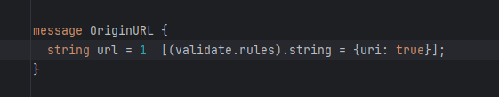
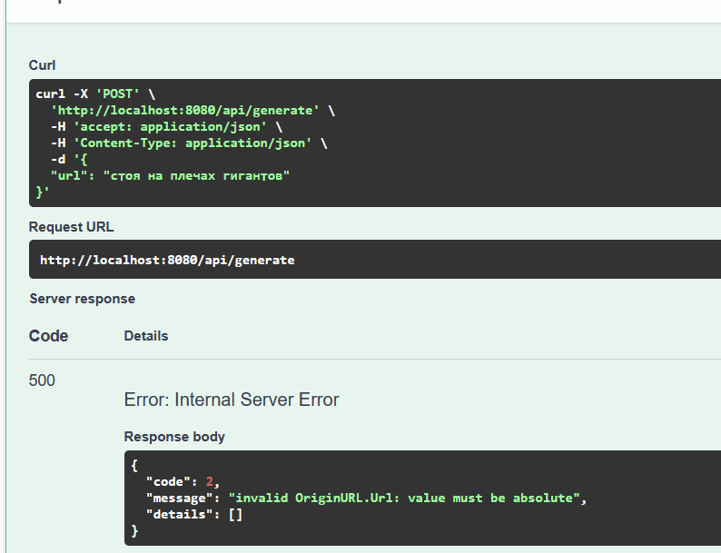
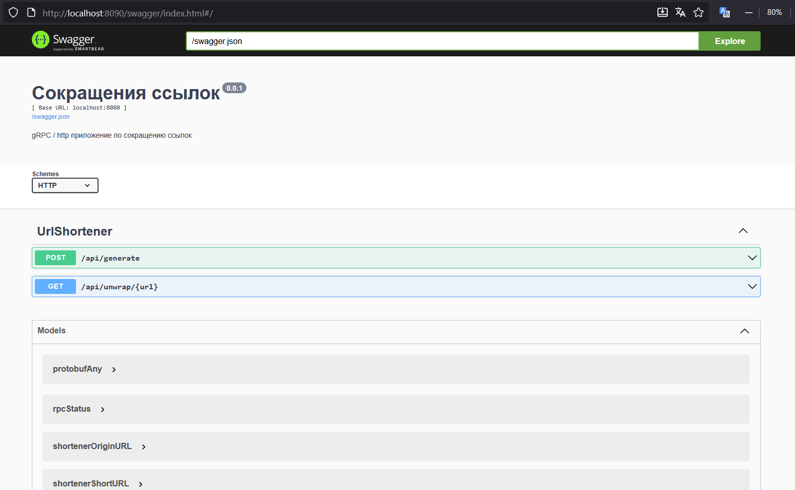
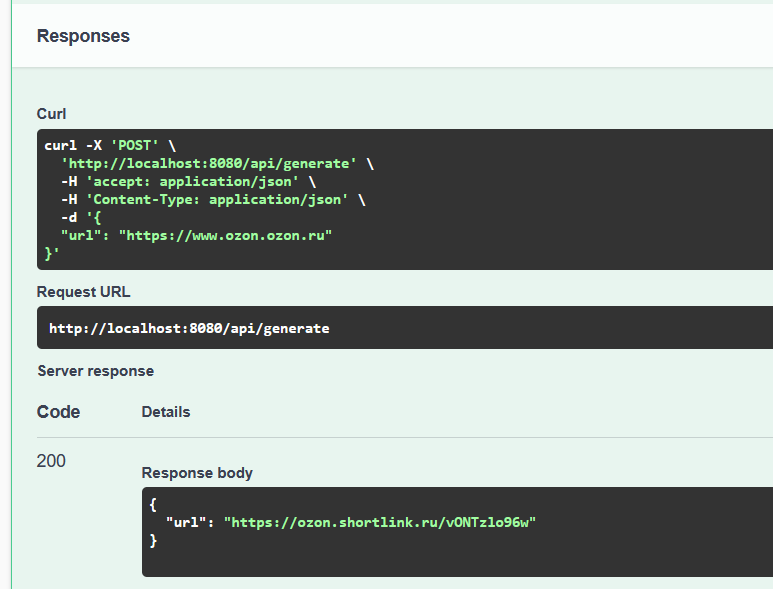
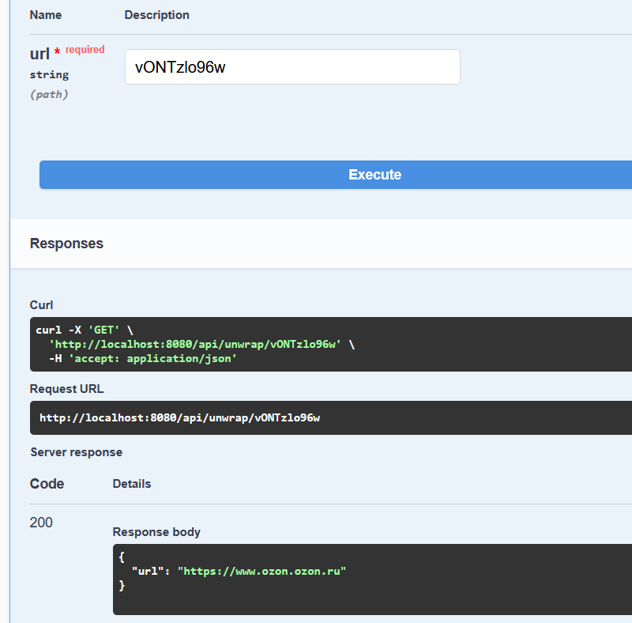
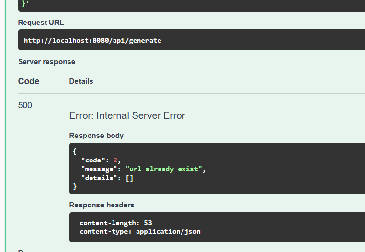
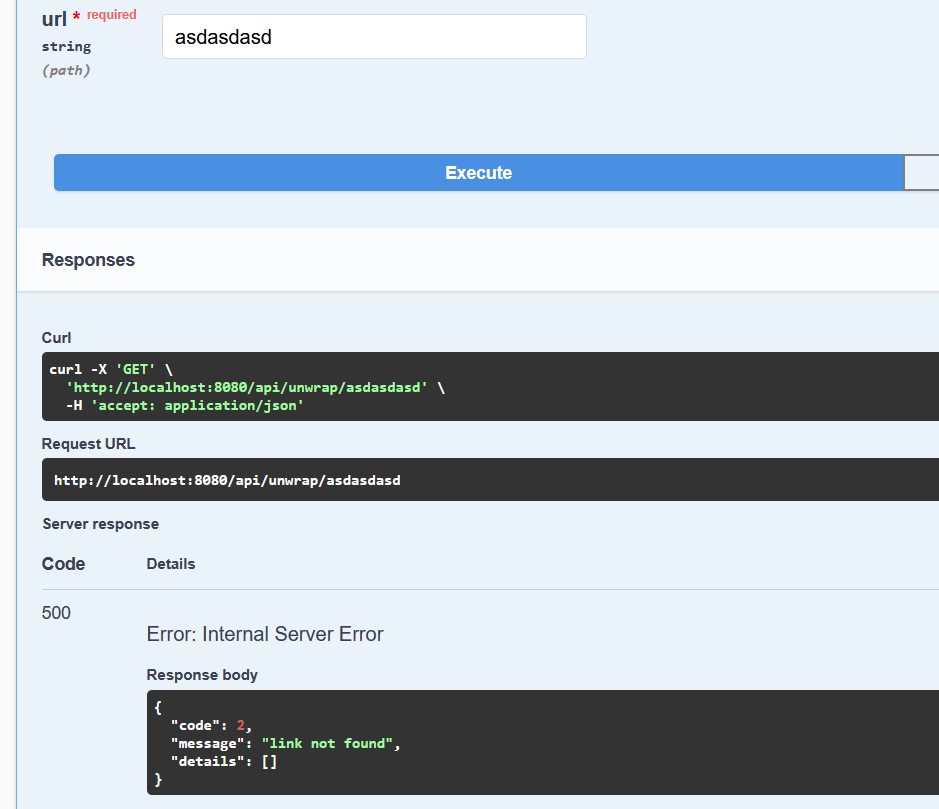
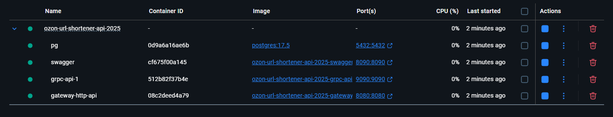

gRPC Благодаря Validate в опциях протобафа, можно легко проверять, что входной параметр это ссылка

Swagger

создание ссылки

получение оригинальной

если сгенерировать повторно, выйдет соответствующая ошибка

если такой ссылки нет, выйдет соответствующая ошибка

Docker
