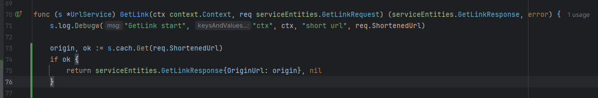
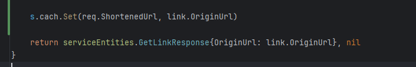
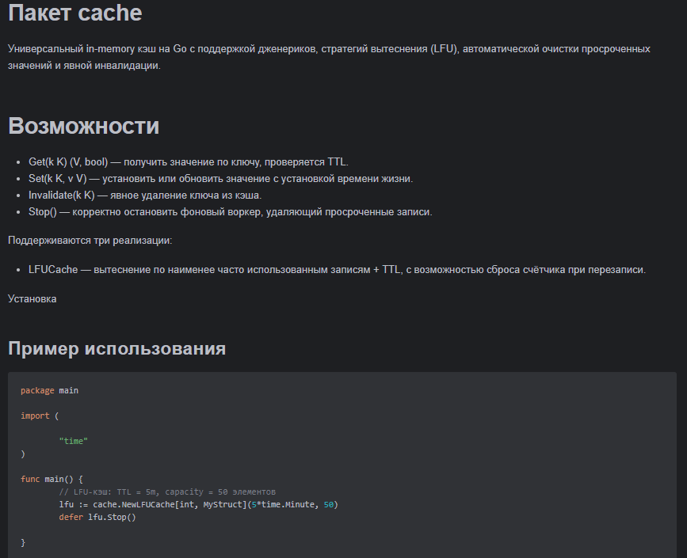

# Запуск:

Потребуется .env файл

```
DB_HOST=postgres
DB_PORT=5432
POSTGRES_USER=postgres
POSTGRES_PASSWORD=secret
POSTGRES_DB=ozon_db
DB_SSLMODE=disable
```

Далее установить зависимости:

```bash
  make grpc-deps
```

И запустить контейнеры

```bash
  make up
```

или

```bash
  docker-compose up
```

# cache

Внедрена моя собственная библиотека инмемори кэширования, с таймаутами, вытеснением LFU по колличеству запросов

На тестах повторные обращения работали значительно быстрее, примерно в 100 раз







# Http-gateway

Я использую протобаф контракт, в котором использую gateway механизм, чтобы перенаправлять запросы с rest на grpc порт,
так же генерируется опенапи спецификация, которая исопльзуется для сваггера

# gRPC

Благодаря Validate в опциях протобафа, можно легко проверять, что входной параметр это ссылка


# Swagger


Создание ссылки


Получение оригинальной


Если сгенерировать повторно, выйдет соответствующая ошибка


Если такой ссылки нет, выйдет соответствующая ошибка


# Docker

